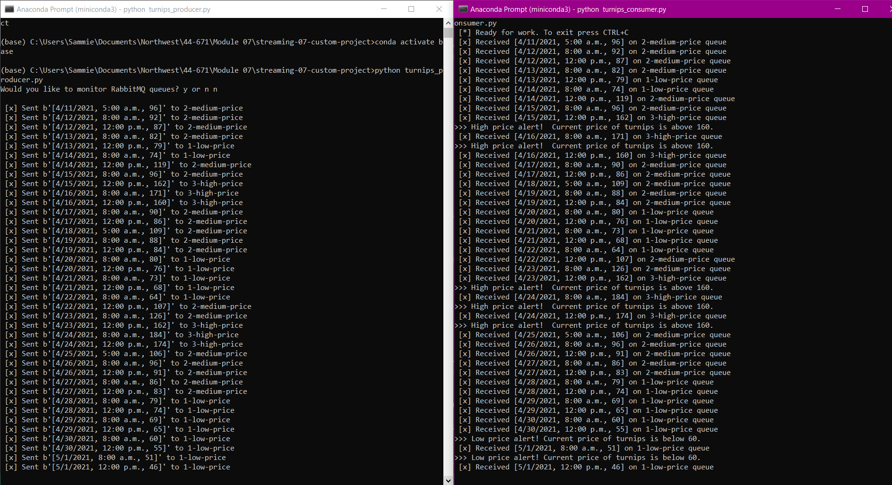
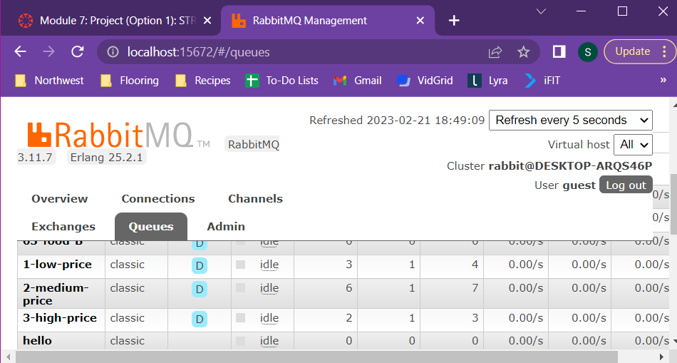

# Project Title: Animal Crossing Turnip Prices - Streaming Data

# streaming-07-custom-project

Author: Sammie Bever
Date: February 14, 2023
Class: Streaming Data
Assignment: Module 07

For my custom project, I will be reading from a csv file using a producer. I will also have a consumer reading tasks from the queue.

# Assignment Requirements
Project: Build a unique custom streaming process based on what you've learned working with Python, pika, and RabbitMQ.

## Option 1 - Custom Project for your GitHub Repo / Portfolio
1. Create a custom GitHub project repo to showcase your skills. Done
2. Describe and plan an new implementation using RabbitMQ for streaming data. Done
3. Create one or more custom producers. Done - 1 producer
4. Create one or more custom consumers. Done - 1 consumer
5. You can simulate your initial data source using Faker or some other file - or read from an API (not too much, too often, or too fast!) Done - read from csv
6. How did you explore exchanges and queues? I used the default exchange and 3 queues - low, medium, and high prices
7. Did you use time windows? No.
8. What made this an interesting streaming project for you? It is data from a video game that I enjoy playing. If these were live prices, it could help me earn money in the game. This could easily be applied to similar data in the real world as well.

# Project Description
## Conditions
low price queue = 0-80
medium price queue = 81-130
high price queue = 131+

## Alerts
Low price alert = below 60
High price alert = above 160

## describe your unique steaming analytics project - what / why 
I found a dataset that looks at trading prices from a video game I enjoy playing called “Animal Crossing.” In the game, you can buy and sell turnips. If you trade strategically (ex: buy them when the price is low and sell them when the price is high), you can make a profit off of your turnips. In the game, they call it the “Stalk Market.” The dataset that I found shows the turnip price per day and time (prices were checked three times a day). I think it would be interesting to stream this dataset and be alerted when turnip prices are especially low (ideal for buying) and when turnip prices are especially high (ideal for selling) that way I could easily turn a profit in my game. I have set this up to sort prices into 3 queues - low, medium, and high prices. Then I have set alerts for especially low and high prices.  

## describe and link to your data original data sources. 
Dataset found on the following website (dataset is called “turnips”):
https://vincentarelbundock.github.io/Rdatasets/datasets.html

Description of dataset: 
https://vincentarelbundock.github.io/Rdatasets/doc/stevedata/turnips.html

Link to csv:
https://vincentarelbundock.github.io/Rdatasets/csv/stevedata/turnips.csv

## describe your process - producers, consumers, exchanges, queues
Producer - I have one producer that reads from a csv file called turnips.csv. Each row of the csv is a new message. The producer sorts messages into low, medium, and high price queues (RabbitMQ).

Consumer - I have one consumer with 3 callbacks (1 for each queue - low, medium, and high prices). The consumer is set to send alerts if the turnip price drops below a certain price (60) or goes above a certain price (160) as these are ideal prices for buying and selling.

Exchanges - I used the default exchange.

Queues - I have 3 queues - low, medium, and high turnip prices.

## provide clickable links to the output of your simulation or process. 
out_producer - https://github.com/s520250/streaming-07-custom-project/blob/main/out_producer.txt
out_consumer - https://github.com/s520250/streaming-07-custom-project/blob/main/out_consumer.txt

# Screenshots
## Producer & Consumer Running Concurrently
Screenshot shows:
- Producer & consumer running concurrently in 2 anaconda terminals
- High and low price alerts
- Messages being routed to 3 different queues

## RabbitMQ Server - 3 Queues
